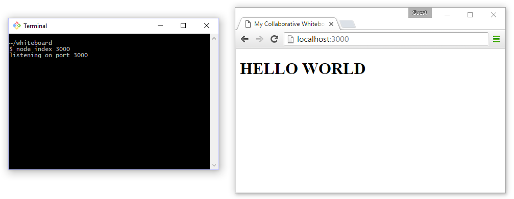
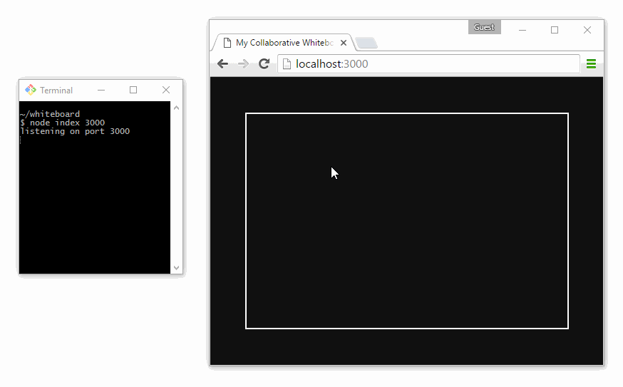

# Creating a simple whiteboard
 <p align="center">|   [next &gt; (Simultaneous drawing with multiple users)](GUIDE-v2.md)</p>

---
#### Introduction

This is the first in a series of four tutorials that walk you through the creation of a real-time collaborative whiteboard with Socket.IO. A fully featured demo can be found [here](paradite.com:3000).

The HTML5 `canvas` API allows web developers to draw graphics via scripting. By itself it already provides several useful methods for drawing simple shapes and lines. This makes it ideal for implementing our interactive whiteboard. In this tutorial, we will learn to create a simple local interactive whiteboard on a webpage, and serve it from a `node.js` server.

Try the [chat](http://socket.io/get-started/chat/) guide if you haven't already done so. It takes very little time and will familiarize you with useful parts of the `socket.io` API. 

---
#### Setup the server

We will use the Node.JS web framework `express` to serve our files. Just like in the [chat guide](http://socket.io/get-started/chat/), we start with an empty project directory (you can call it `whiteboard`). Let's create a `package.json` manifest file to describe the project:
```json
{
  "name": "my-collaborative-whiteboard",
  "version": "0.0.1",
  "description": "collaborative whiteboard",
  "dependencies": {}
}
```

Then, we install the express package and automatically update our dependencies:
```
npm install --save express@4.13.4
```

Now we create an `index.js` file for Node.JS to setup our application:
```javascript
var express = require('express');
var app = express();
var http = require('http').Server(app);

app.get('/', function(req, res){
  res.sendFile('index.html', {root: __dirname});
});

http.listen(parseInt(process.argv[2]), function(){
  console.log('listening on port ' + process.argv[2]);
});
```
This means that when we run `node index 3000`, the server listens on port 3000 (feel free to use any other port number), and we serve the `index.html` file in the project root directory to clients. We don't have our `index.html` file yet, so let's create one:
```html
<!DOCTYPE html>
<html lang="en">
<head>
  <meta charset="UTF-8">
  <title>My Collaborative Whiteboard</title>
</head>
<body>
  <h1>HELLO WORLD</h1>
</body>
```

Now if we run `node index 3000` and point our browser to `localhost:3000`, we should see:

```
> IMAGE PLACEHOLDER: browser and terminal
```

---
#### Setup the whiteboard

We will use the HTML5 `canvas` element to implement a simple whiteboard. Remove the line `<h1>HELLO WORLD</h1>`. Next we start by declaring the canvas used by the whiteboard in `index.html`, in the `<body>` tag:
```html
<body>
  <div id="whiteboard-container">
    <canvas class="whiteboard">Canvas not supported :(</canvas>
  </div>
</body>
```

Then we style the page and canvas by adding the following style code to the `<head>` tag:
```html
<head>
...
  <style>
    body {
      background-color: #101010;
      margin: 0px;
      overflow: hidden;
    }
    #whiteboard-container {
      height: 600px;
      width: 900px;
      border: 2px solid white;
      position: absolute;
      top: 0;
      bottom: 0;
      left: 0;
      right: 0;
      margin: auto;
    }
    #whiteboard-container canvas {
      position: absolute;
    }
  </style>
...
</head>
```
If you want to change the dimensions of the whiteboard, change the `height` and `width` values under the `#whiteboard-container` ruleset.

We will draw directly to the `CanvasRenderingContext2D` of our `canvas` element, so we initialise the whiteboard by adding an inline `<script>` to the bottom of the `<body>` tag:
```html
<body>
...
  <script>
    // size the whiteboard to parent container
    var container = document.getElementById('whiteboard-container');
    var wb = container.querySelector('canvas.whiteboard');
    wb.height = container.clientHeight;
    wb.width = container.clientWidth;

    // set stroke style
    var ctx = wb.getContext('2d');
    ctx.strokeStyle = '#aa88ff';
    ctx.lineWidth = 2;
    ctx.lineCap = 'round';
    ctx.lineJoin = 'round';
  </script>
</body>
```

---
#### Drawing logic

We want the user's mouse movements to be recorded on the whiteboard, but **only** while the main mouse button is held down. To do that, we will write our own handlers for the `mousedown`, `mouseup`, and `mousemove` events. Append the following code to the inline script:
```html
<script>
...
  // draw logic
  container.onmousedown = function(e){
    //TODO
  };
  container.onmousemove = function(e){
    //TODO
  };
  container.onmouseup = function(e){
    //TODO
  };
</script>
```

First, we need to track when the user holds the main mouse button down. We'll use a boolean variable for this:
```html
<script>
...
  // draw logic
  var isDrawing = false;
  
  container.onmousedown = function(e){
    isDrawing = true;
  };
  container.onmousemove = function(e){
    if (!isDrawing) return;
  };
  container.onmouseup = function(e){
    isDrawing = false;
  };
</script>
```

Next we need to store the previous position of the pointer, so we can draw a line on the canvas linking the previous and current mouse position every time `mousemove` fires and `isDrawing` is true:
```html
<script>
...
// draw logic
var prevX, prevY,
    isDrawing = false;

container.onmousedown = function(e){
  isDrawing = true;
  prevX = e.offsetX;
  prevY = e.offsetY;
};
container.onmousemove = function(e){
  if (!isDrawing) return;
  ctx.beginPath();
  ctx.moveTo(prevX, prevY);
  ctx.lineTo(e.offsetX, e.offsetY);
  ctx.stroke();
  prevX = e.offsetX;
  prevY = e.offsetY;
};
container.onmouseup = function(e){
  isDrawing = false;
};
</script>
```

Now we have a simple but functional whiteboard:

```
> VIDEO PLACEHOLDER: browser view, drawing shapes in whiteboard
```

If we play around with the whiteboard, we might notice something odd:

```
> VIDEO PLACEHOLDER: browser view, start cursor in borders, hold mouse button, 
    move cursor out of bottom border and back in through top border, release mouse button. 
    Hold mouse button, leave through left border, reenter through right border.
```
This behaviour is caused by:

1. The `container.onmouseup` callback not firing when releasing the mouse button outside the whiteboard, so `isDrawing` is stuck on `true`
2. The `prevX` and `prevY` variables still holding the last position of the mouse inside the whiteboard even when the mouse leaves and reenters from a different location

Let's fix the first issue by hooking the `mouseup` callback to the entire document instead of just the canvas:
```javascript
document.onmouseup = function(e){
  isDrawing = false;
};
```

And we fix the second issue by firing our `onmousedown` callback (to reset the `prevX` and `prevY` variables) upon the pointer reentering the whiteboard. Append the following callback for `mouseenter` to the inline script:
```javascript
container.onmouseenter = function(e) {
  if (!isDrawing) return;
  container.onmousedown(e);
};
```

Let's see if it's fixed:

```
> VIDEO PLACEHOLDER: browser view, start cursor in borders, 
    hold mouse button, draw randomly weaving in and out the borders
```
Great! Now we have a simple and responsive whiteboard.

---
#### Final code

Here is what our code should look like at this point:

`index.js`
```javascript
var express = require('express');
var app = express();
var http = require('http').Server(app);

app.get('/', function(req, res){
  res.sendFile('index.html', {root: __dirname});
});

http.listen(parseInt(process.argv[2]), function(){
  console.log('listening on port ' + process.argv[2]);
});
```

`index.html`
```html
<!DOCTYPE html>
<html lang="en">
<head>
  <meta charset="UTF-8">
  <title>Collaborative Whiteboard</title>
  <style>
    body {
      background-color: #101010;
      margin: 0px;
      overflow: hidden;
    }
    #whiteboard-container {
      height: 600px;
      width: 900px;
      border: 2px solid white;
      position: absolute;
      top: 0;
      bottom: 0;
      left: 0;
      right: 0;
      margin: auto;
    }    
    #whiteboard-container canvas {
      position: absolute;
    }
  </style>
</head>

<body>
  <div id="whiteboard-container">
    <canvas class="whiteboard">Canvas not supported :(</canvas>
  </div>

  <script>
    // size the whiteboard to parent container
    var container = document.getElementById('whiteboard-container');
    var wb = container.querySelector('canvas.whiteboard');
    wb.height = container.clientHeight;
    wb.width = container.clientWidth;

    // set stroke style
    var ctx = wb.getContext('2d');
    ctx.strokeStyle = '#aa88ff';
    ctx.lineWidth = 2;
    ctx.lineCap = 'round';
    ctx.lineJoin = 'round';

    // draw logic
    var prevX, prevY,
        isDrawing = false;

    container.onmousedown = function(e){
      isDrawing = true;
      prevX = e.offsetX;
      prevY = e.offsetY;
    };
    container.onmousemove = function(e){
      if (!isDrawing) return;
      ctx.beginPath();
      ctx.moveTo(prevX, prevY);
      ctx.lineTo(e.offsetX, e.offsetY);
      ctx.stroke();
      prevX = e.offsetX;
      prevY = e.offsetY;
    };
    document.onmouseup = function(){
      isDrawing = false;
    };
    container.onmouseenter = function(e) {
      if (!isDrawing) return;
      container.onmousedown(e);
    };
  </script>
</body>
</html>
```

---
#### Homework

Here are some ideas to improve the application:
- Some way for the user to clear the screen
- Let users erase parts of the board with the mouse
- Some way to resize the board and not lose the strokes
- Different pen sizes

---
#### Getting this example

You can find it on GitHub [here](.).
```
git clone https://github.com/nus-fboa2016-si/whiteboard.git
```
```
cd whiteboard/guide/v1
```

---
 <p align="center">|   [next &gt; (Simultaneous drawing with multiple users)](GUIDE-v2.md)</p>
