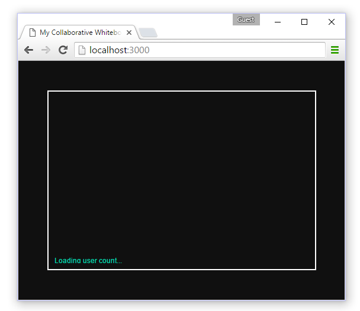
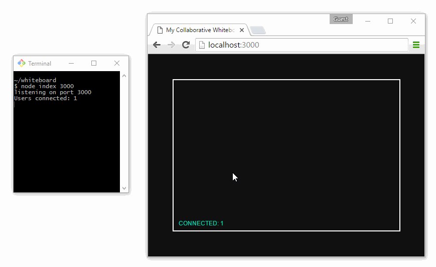
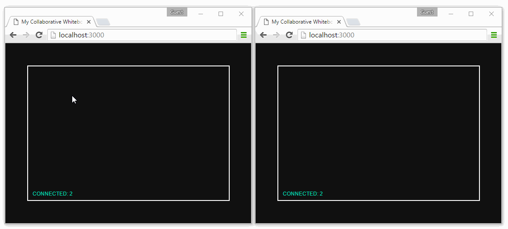

# Simultaneous drawing with multiple users
 <p align="center">[(Creating a simple whiteboard) &lt; previous](GUIDE-v1.md)  |   [next &gt; (Augmenting user strokes: color)](GUIDE-v3.md)</p>
 
---
#### Collaborate in real-time.

This is the second in a series of four tutorials that walk you through the creation of a real-time collaborative whiteboard with Socket.IO. A fully featured demo can be found [here](https://socket-io-whiteboard.herokuapp.com/).

In our [previous](GUIDE-v1.md) installment of the guide, we created a functional whiteboard and served it to client browsers. In this tutorial we will add the ability for multiple users to draw on the board simultaneously. To do this we will use Socket.IO to push new strokes to all other connected clients.

---
#### Integrating Socket.IO

Socket.IO is composed of two parts:
- A server that integrates with (or mounts on) the Node.JS `http` Server: `socket.io`
- A client library that loads on the browser side: `socket.io-client`
During development, the server-side `socket.io` serves the client library automatically for us, so we only have to install one module:
```
npm install --save socket.io
```

This installs the module and updates the dependency list in `package.json`. Now we will add `socket.io` to our server. We edit `index.js` as such:
```javascript
var express = require('express');
var app = express();
var http = require('http').Server(app);
var io = require('socket.io')(http);

io.on('connection', function(socket){
  console.log('A user connected');
  socket.on('disconnect', function(){
    console.log('A user disconnected');
  });
});

app.get('/', function(req, res){
  res.sendFile('index.html', {root: __dirname});
});

http.listen(parseInt(process.argv[2]), function(){
  console.log('listening on port ' + process.argv[2]);
});
```
Note how we initialize the `socket.io` instance by passing it the `http` server object. Now we include the `socket.io-client` script in our client-side `index.html`, above the `<script>` tag with our whiteboard logic:
```html
<body>
...
    <canvas class="whiteboard">Canvas not supported :(</canvas>
  </div>
  <script src="/socket.io/socket.io.js"></script>
...
</body>
```

This is all we need to make `socket.io-client` available for the client, which exposes the `io` global that handles the connection between client and server. Set up the socket by adding this line to the top of our `<script>` in `index.html`:
```javascript
var socket = io();
```

Let's see what happens when we visit and leave the page on our browser:
```
node index 3000
```


That's all it takes for Socket.IO to maintain the connection between client and server. We can now emit and receive data from both ends, and handle network events like clients connecting, disconnecting, or reconnecting.

---
#### Structuring project files

Right now we only have two files in use: `index.html` and `index.js`. If you have implemented some of the 'homework' features suggested in the previous tutorial, you must have realised that having

- style rules
- document markup
- script code

all in the same file results in a lot of visual clutter. Let's restructure our project directory with a mind for separation of concerns.

We will do these in order:

1. Create a `public` folder to hold all public assets that we serve to clients
2. Move `index.html` into the `public` folder
3. Extract the contents of the `<style>` tag into `public/index.css`
4. Extract the contents of the `<script>` tag into `public/whiteboard.js`

At this point our project directory should look something like this:
```
/public
    index.html
    index.css
    whiteboard.js
index.js
package.json
/node_modules
```

We still have to link `public/index.css` and `public/whiteboard.js` back to `public/index.html`. Make sure the `whiteboard.js` script is below all other scripts:
```html
<!DOCTYPE html>
<html lang="en">
<head>
  <meta charset="UTF-8">
  <title>Collaborative Whiteboard</title>
  <link rel="stylesheet" type="text/css" href="index.css">
</head>

<body>
  <div id="whiteboard-container">
    <canvas class="whiteboard">Canvas not supported :(</canvas>
  </div>

  <script src="/socket.io/socket.io.js"></script>
  <script src="/whiteboard.js"></script>
</body>
</html>
```

and finally we have to update `index.js` to serve all assets in `/public`. Replace this statement:
```javascript
app.get('/', function(req, res){
  res.sendFile('index.html', {root: __dirname});
});
```
with this:
```javascript
app.use(express.static('public'));
```

---
#### Displaying number of connected users

First, let's show our users that they are not alone. We will display the number of connected users at the bottom left corner of our whiteboard as svg text. Add the svg text element under the container `div`, below the `canvas` tag:
```html
<div id="whiteboard-container">
  <canvas class="whiteboard">Canvas not supported :(</canvas>
  <svg height="30px" width="100%" class="user-count">
    <text x="0" y="30" class="user-count">Loading user count...</text>
  </svg>
</div>
```

The user count element will show `Loading user count...` until we update the text in our `public/whiteboard.js` script. Now we style the element by adding these rulesets to `public/index.css`:
```css
#whiteboard-container > svg.user-count {
  height: 30px;
  width: 100%;
  position: absolute;
  left: 10px;
  bottom: 10px;
  cursor: default;
}
#whiteboard-container > svg > text.user-count {
  fill: #00D5B0;
  font-size: 12px;
  font-family: sans-serif;
  text-anchor: start;
}
```

We also need to prevent our cursor changing from type `default` to type `text`. Change `container.onmousedown` in `public/whiteboard.js`:
```javascript
container.onmousedown = function(e){
  e.preventDefault();
  isDrawing = true;
  prevX = e.offsetX;
  prevY = e.offsetY;
};
```

Here is what our user count element looks like now:
```
node index 3000
```



Now let's decide how to update the user count. First we have to track the canonical user count on the server, and every time a client connects or disconnects, the canonical count is updated. Change `index.js` as such:
```javascript
...
var io = require('socket.io')(http);

var userCount = 0;
io.on('connection', function(socket){
  userCount++;
  console.log('Users connected: ' + userCount);

  socket.on('disconnect', function(){
    userCount--;
    console.log('Users connected: ' + userCount);
  });
});

app.use(express.static('public'));
...
```

Here it is in action:
```
node index 3000
```


Next, we have to send the updated user count to all clients every time someone (dis)connects. We will emit the user count as an `'user count'` event. Update the `io.on(...)` statement in `index.js`:
```javascript
io.on('connection', function(socket){
  userCount++;
  console.log('Users connected: ' + userCount);
  io.emit('user count', userCount);

  socket.on('disconnect', function(){
    userCount--;
    console.log('Users connected: ' + userCount);
    io.emit('user count', userCount);
  });
});
```

Finally we close the circuit by capturing the `'user count'` event on the client and manipulating our user count element. Add this code to the bottom of the `public/whiteboard.js` file:
```javascript
// user count
socket.on('user count', updateUserCount);
var userCountText = container.querySelector('text.user-count');
function updateUserCount(count) {
  userCountText.textContent = 'CONNECTED: ' + count;
}
```

Let's see it in action:
```
node index 3000
```


---
#### Drawing across overlapping elements

Take some time to play with the whiteboard again. You will notice a problem when drawing into the user count text region:


This is caused by:
- Our mouse event handlers using `e.offsetX` and `e.offsetY`.
- The text count `svg` being 'on top of' the container `div`, so the `MouseEvent` target points to it instead of the container.

Let's solve this problem once and for all. We will implement a function to get the mouse coordinates relative to our `container` element **regardless** of the `MouseEvent`'s target. Append this function in `whiteboard.js` below our mouse event handlers but above the user count code:
```javascript
function getMouseEventContainerPos(e) {
  return {
    x: e.offsetX + e.target.getBoundingClientRect().left - container.getBoundingClientRect().left,
    y: e.offsetY + e.target.getBoundingClientRect().top - container.getBoundingClientRect().top
  };
}
```
which will take a MouseEvent as the sole argument and return an object containing the `x` and `y` coordinates relative to our `container` element. Now we will update our mouse event handler code to use this function:
```javascript
container.onmousedown = function(e){
  e.preventDefault();
  isDrawing = true;
  var pos = getMouseEventContainerPos(e);
  prevX = pos.x;
  prevY = pos.y;
};

container.onmousemove = function(e){
  if (!isDrawing) return;
  var pos = getMouseEventContainerPos(e);
  ctx.beginPath();
  ctx.moveTo(prevX, prevY);
  ctx.lineTo(pos.x, pos.y);
  ctx.stroke();
  prevX = pos.x;
  prevY = pos.y;
};
```

The mouse position is correctly mapped now:



---
#### Displaying and synchronizing strokes from multiple users

We finally get to the heart of this tutorial-- letting users see each other drawing on the whiteboard simultaneously. Just like what we did for the user count before, we will use our own events to transfer drawing data between client and server.

Every time our `container.onmousemove` callback fires, a new line segment is drawn on the whiteboard canvas. To replicate this line segment across the other clients, we have to serialize this line and send it to the server, which will broadcast it to all other clients. Since lines can be defined by their start and end points, we will use objects of this format to serialize our lines:
```javascript
{
  startX: // x pos of point connecting previous this line to the previous one
  startY: // y pos of point connecting previous this line to the previous one
  endX: // self explanatory
  endY: // ditto
}
```

Next we extract the canvas line drawing code from `container.onmousemove` as a separate function. Add this below the `getMouseEventContainerPos` function declaration:
```javascript
function drawLine(line) {
  ctx.beginPath();
  ctx.moveTo(line.startX, line.startY);
  ctx.lineTo(line.endX, line.endY);
  ctx.stroke();
}
```

Our `container.onmousemove` body should now look like this:
```javascript
container.onmousemove = function(e){
  if (!isDrawing) return;
  var pos = getMouseEventContainerPos(e);
  var newLine = {
    startX: prevX,
    startY: prevY,
    endX: pos.x,
    endY: pos.y
  };
  drawLine(newLine);
  prevX = pos.x;
  prevY = pos.y;
};
```

Now we will emit the new line as a `'draw line'` event to the server everytime a new line segment is created. Add this statement below the `drawLine(newLine);` call shown above:
```javascript
socket.emit('draw line', newLine);
```

Our server has to receive the line data and broadcast it to everyone **else**. Append this statement to the `'connection'` callback body in `index.js`:
```javascript
socket.on('draw line', function(line){
  socket.broadcast.emit('draw line', line);
});
```
Note that we are reusing the `'draw line'` event name for this broadcast.

Finally, the clients have to capture this `'draw line'` event and use the data to draw that same line on their own whiteboard canvases. Add this statement right above our `drawLine` function declaration:
```javascript
socket.on('draw line', drawLine);
```

With this, we are done! Check it out:
```
node index 3000
```



---
#### Final code

Here is what our code should look like at this point:

`index.js`
```javascript
var express = require('express');
var app = express();
var http = require('http').Server(app);
var io = require('socket.io')(http);

var userCount = 0;
io.on('connection', function(socket){
  userCount++;
  console.log('Users connected: ' + userCount);
  io.emit('user count', userCount);

  socket.on('disconnect', function(){
    userCount--;
    console.log('Users connected: ' + userCount);
    io.emit('user count', userCount);
  });

  socket.on('draw line', function(line){
    socket.broadcast.emit('draw line', line);
  });
});

app.use(express.static('public'));

http.listen(parseInt(process.argv[2]), function(){
  console.log('listening on port ' + process.argv[2]);
});
```

`public/index.html`
```html
<!DOCTYPE html>
<html lang="en">
<head>
  <meta charset="UTF-8">
  <title>Collaborative Whiteboard</title>
  <link rel="stylesheet" type="text/css" href="index.css">
</head>

<body>
  <div id="whiteboard-container">
    <canvas class="whiteboard">Canvas not supported :(</canvas>
    <svg height="30px" width="100%" class="user-count">
      <text x="0" y="30" class="user-count">Loading user count...</text>
    </svg>
  </div>
  
  <script src="/socket.io/socket.io.js"></script>
  <script src="/whiteboard.js"></script>
</body>
</html>
```

`public/index.css`
```css
body {
  background-color: #101010;
  margin: 0px;
  overflow: hidden;
}
#whiteboard-container {
  height: 600px;
  width: 900px;
  border: 2px solid white;
  position: absolute;
  top: 0px;
  bottom: 0px;
  left: 0px;
  right: 0px;
  margin: auto;
}
#whiteboard-container canvas {
  position: absolute;
}
#whiteboard-container > svg.user-count {
  height: 30px;
  width: 100%;
  position: absolute;
  left: 10px;
  bottom: 10px;
  cursor: default;
}
#whiteboard-container > svg > text.user-count {
  fill: #00D5B0;
  font-size: 12px;
  font-family: sans-serif;
  text-anchor: start;
}
```

`public/whiteboard.js`
```javascript
var socket = io();

// whiteboard ------------------------------------------

// size the whiteboard to parent container
var container = document.getElementById('whiteboard-container');
var wb = container.querySelector('canvas.whiteboard');
wb.height = container.clientHeight;
wb.width = container.clientWidth;

// set stroke style
var ctx = wb.getContext('2d');
ctx.strokeStyle = '#aa88ff';
ctx.lineWidth = 2;
ctx.lineCap = 'round';
ctx.lineJoin = 'round';

// draw logic ------------------------------------------

var prevX, prevY,
    isDrawing = false;

container.onmousedown = function(e){
  e.preventDefault();
  isDrawing = true;
  var pos = getMouseEventContainerPos(e);
  prevX = pos.x;
  prevY = pos.y;
};

container.onmousemove = function(e){
  if (!isDrawing) return;
  var pos = getMouseEventContainerPos(e);
  var newLine = {
    startX: prevX,
    startY: prevY,
    endX: pos.x,
    endY: pos.y
  };
  drawLine(newLine);
  socket.emit('draw line', newLine);
  prevX = pos.x;
  prevY = pos.y;
};

document.onmouseup = function(){
  isDrawing = false;
};

container.onmouseenter = function(e) {
  if (!isDrawing) return;
  container.onmousedown(e);
};

function getMouseEventContainerPos(e) {
  return {
    x: e.offsetX + e.target.getBoundingClientRect().left - container.getBoundingClientRect().left,
    y: e.offsetY + e.target.getBoundingClientRect().top - container.getBoundingClientRect().top
  };
}

socket.on('draw line', drawLine);
function drawLine(line) {
  ctx.beginPath();
  ctx.moveTo(line.startX, line.startY);
  ctx.lineTo(line.endX, line.endY);
  ctx.stroke();
}

// user count ------------------------------------------

socket.on('user count', updateUserCount);
var userCountText = container.querySelector('text.user-count');
function updateUserCount(count) {
  userCountText.textContent = 'CONNECTED: ' + count;
}
```

---
#### Homework

Here are some ideas to improve the application:
- Show newly connected users what was drawn before they connected
- Show each user's mouse position within the board (not just when actively drawing)
- Show ownership of each continuous stroke
- Save and display a user's strokes next time they connect
- Implement touch compatibility

---
#### Getting this example

You can find it on GitHub [here](.).
```
git clone https://github.com/nus-fboa2016-si/whiteboard.git
```
```
cd whiteboard/guide/v2
```

---
 <p align="center">[(Creating a simple whiteboard) &lt; previous](GUIDE-v1.md)  |   [next &gt; (Augmenting user strokes: color)](GUIDE-v3.md)</p>
