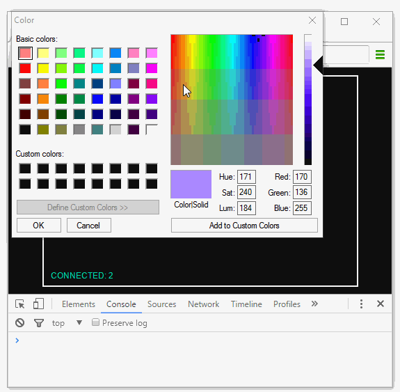

# Augmenting user strokes: color
 <p align="center">[(Simultaneous drawing with multiple users) &lt; previous](GUIDE-v2.md)  |   [next &gt; (Adding graphical effects: 3D particles)](GUIDE-v4.md)</p>
 
---
#### Different strokes for different folks.

This is the third in a series of four tutorials that walk you through the creation of a real-time collaborative whiteboard with Socket.IO. A fully featured demo can be found [here](https://socket-io-whiteboard.herokuapp.com/).

In our [previous](GUIDE-v2.md) installment of the guide, we completed our collaborative whiteboard. It may be complete, but it is a pretty bare-bones application. You've been waiting for this collaborative whiteboard guide for a long time, so we'll go the extra mile with you: for our last two tutorials of the guide, we will add more features and aim to bring our version of the whiteboard as close as possible to feature parity with the [demo version](https://socket-io-whiteboard.herokuapp.com/), together.

In this tutorial we will let users color their strokes. There are many other ways we can augment the strokes (a list of suggestions can be found at the bottom of this tutorial), but we will focus only on color here; the basic concepts of capturing different input and serializing, sending, receiving, and deserializing additional data apply across any other enhancements you may wish to make.

---
#### Capturing the user's color choice

There is a huge variety of browser color picker libraries out in the ecosystem, but in order to minimalise the number of dependencies in this guide, we will use the HTML5 color `<input>` for this job.

First we need to create the UI element for our color picker. Let's go with a simple and clean circle. The circle will be centered at the top of our whiteboard, and its fill color should match the user's current color choice. First we add the color picker element to `public/index.html`, right below the user count `<svg>` element:
```html
...
</svg>
<div style="width: 100%; position: absolute;">
  <div class="color-picker-wrapper" style="background-color: #aa88ff;">
    <input class="color-picker" type="color" value="#aa88ff">
  </div>
</div>
```

Then we style the color picker by adding these rulesets to `public/index.css`:
```css
#whiteboard-container .color-picker-wrapper {
  border-radius: 100%;
  margin-top: 20px;
  margin-left: auto;
  margin-right: auto;
  height: 32px;
  width: 32px;
  border: 1.5px solid #101010;
}
#whiteboard-container .color-picker {
  opacity: 0;
  width: inherit;
  height: inherit;
  padding: 0;
}
.color-picker:hover {
  cursor: pointer;
}
```
The key idea here is to style the wrapper element into the desired shape and center it, then make the actual `<input>` element transparent. Let's take a look at the color picker element when we are done:


Right now the user can choose a new color by clicking on our color picker, but it won't actually do anything. We need to write code to track the current color choice of the user and change it when needed. Let's declare a `colorString` variable to track the current color choice in the format of a CSS color string. Make the following changes to the `// set stroke style` section of  `public/whiteboard.js`:
```javascript
...
// set stroke style
var colorString = '#aa88ff';    //new
var ctx = wb.getContext('2d');
ctx.strokeStyle = colorString;  //change
ctx.lineWidth = 2;
ctx.lineCap = 'round';
ctx.lineJoin = 'round';
...
```

We will use the `change` event to detect when the user commits their new color choice through the `<input>`. Let's append some code at the bottom of `public/whiteboard.js` to do that:
```javascript
// color picker
var colorPickerWrapper = container.querySelector('.color-picker-wrapper');
var colorPickerInput = colorPickerWrapper.querySelector('input.color-picker');
colorPickerInput.onchange = function() {
  colorPickerWrapper.style.backgroundColor = colorPickerInput.value;
  colorString = colorPickerInput.value;
  console.log(colorString);
};
```

Now we can test that our color changes are reflected in the `colorString` variable:



We don't need it any more, so remove the `console.log(colorString)` line in the `onchange` callback.

---
#### Coloring the user's new strokes

Now that our `colorString` variable correctly reflects the user's color choice, we just need to style the user's future line segments with it. Add a new field to our line segment object creation inside `container.onmousemove` to hold the line's color.
```javascript
container.onmousemove = function(e){
  ...
  var newLine = {
    startX: prevX,
    startY: prevY,
    endX: pos.x,
    endY: pos.y,
    colorString: colorString //new
  };
  drawLine(newLine);
  ...
};
```

Then update the `drawLine` function to read the `line` object's color field and style the strokes appropriately:
```javascript
function drawLine(line) {
  ctx.strokeStyle = line.colorString; //new
  ctx.beginPath();
  ctx.moveTo(line.startX, line.startY);
  ctx.lineTo(line.endX, line.endY);
  ctx.stroke();
}
```

Since the data is transparent to our server, we need not change anything in `index.js`. In fact, it should already work- right now. Let's see it in action:


That's it! Pretty simple, right?

---
#### Final code

Here is what your code should look like at this point:

`index.js` (no change)
```javascript
var express = require('express');
var app = express();
var http = require('http').Server(app);
var io = require('socket.io')(http);

var userCount = 0;

io.on('connection', function(socket){
  userCount++;
  console.log('Users connected: ' + userCount);
  io.emit('user count', userCount);

  socket.on('disconnect', function(){
    userCount--;
    console.log('Users connected: ' + userCount);
    io.emit('user count', userCount);
  });

  socket.on('draw line', function(line){
    socket.broadcast.emit('draw line', line);
  });
});

app.use(express.static('public'));

http.listen(parseInt(process.argv[2]), function(){
  console.log('listening on port ' + process.argv[2]);
});
```

`public/index.html`
```html
<!DOCTYPE html>
<html lang="en">
<head>
  <meta charset="UTF-8">
  <title>Collaborative Whiteboard</title>
  <link rel="stylesheet" type="text/css" href="index.css">
</head>

<body>
  <div id="whiteboard-container">
    <canvas class="whiteboard">Canvas not supported :(</canvas>
    <svg height="30px" width="100%" class="user-count">
      <text x="0" y="30" class="user-count">Loading user count...</text>
    </svg>
    <div style="width: 100%; position: absolute;">
      <div class="color-picker-wrapper" style="background-color: #aa88ff;">
        <input class="color-picker" type="color" value="#aa88ff">
      </div>
    </div>
  </div>

  <script src="/socket.io/socket.io.js"></script>
  <script src="/whiteboard.js"></script>
</body>
</html>
```

`public/index.css`
```css
body {
  background-color: #101010;
  margin: 0px;
  overflow: hidden;
}
#whiteboard-container {
  height: 600px;
  width: 900px;
  border: 2px solid white;
  position: absolute;
  top: 0px;
  bottom: 0px;
  left: 0px;
  right: 0px;
  margin: auto;
}
#whiteboard-container canvas {
  position: absolute;
}
#whiteboard-container > svg.user-count {
  height: 30px;
  width: 100%;
  position: absolute;
  left: 10px;
  bottom: 10px;
  cursor: default;
}
#whiteboard-container text.user-count {
  fill: #00D5B0;
  font-size: 12px;
  font-family: sans-serif;
  text-anchor: start;
}
#whiteboard-container .color-picker-wrapper {
  border-radius: 100%;
  margin-top: 20px;
  margin-left: auto;
  margin-right: auto;
  height: 32px;
  width: 32px;
  border: 1.5px solid #101010;
}
#whiteboard-container .color-picker {
  opacity: 0;
  width: inherit;
  height: inherit;
  padding: 0;
}
.color-picker:hover {
  cursor: pointer;
}
```

`public/whiteboard.js`
```javascript
var socket = io();

// whiteboard ------------------------------------------

// size the whiteboard to parent container
var container = document.getElementById('whiteboard-container');
var wb = container.querySelector('canvas.whiteboard');
wb.height = container.clientHeight;
wb.width = container.clientWidth;

// set stroke style
var colorString = '#aa88ff';
var ctx = wb.getContext('2d');
ctx.strokeStyle = colorString;
ctx.lineWidth = 2;
ctx.lineCap = 'round';
ctx.lineJoin = 'round';

// draw logic ------------------------------------------

var prevX, prevY,
    isDrawing = false;

container.onmousedown = function(e){
  e.preventDefault();
  isDrawing = true;
  var pos = getMouseEventContainerPos(e);
  prevX = pos.x;
  prevY = pos.y;
};

container.onmousemove = function(e){
  if (!isDrawing) return;
  var pos = getMouseEventContainerPos(e);
  var newLine = {
    startX: prevX,
    startY: prevY,
    endX: pos.x,
    endY: pos.y,
    colorString: colorString
  };
  drawLine(newLine);
  socket.emit('draw line', newLine);
  prevX = pos.x;
  prevY = pos.y;
};

document.onmouseup = function(){
  isDrawing = false;
};

container.onmouseenter = function(e) {
  if (!isDrawing) return;
  container.onmousedown(e);
};

function getMouseEventContainerPos(e) {
  return {
    x: e.offsetX + e.target.getBoundingClientRect().left - container.getBoundingClientRect().left,
    y: e.offsetY + e.target.getBoundingClientRect().top - container.getBoundingClientRect().top
  };
}

socket.on('draw line', drawLine);
function drawLine(line) {
  ctx.strokeStyle = line.colorString;
  ctx.beginPath();
  ctx.moveTo(line.startX, line.startY);
  ctx.lineTo(line.endX, line.endY);
  ctx.stroke();
}

// user count ------------------------------------------

socket.on('user count', updateUserCount);
var userCountText = container.querySelector('text.user-count');
function updateUserCount(count) {
  userCountText.textContent = 'CONNECTED: ' + count;
}

// color picker ----------------------------------------

var colorPickerWrapper = container.querySelector('.color-picker-wrapper');
var colorPickerInput = colorPickerWrapper.querySelector('input.color-picker');
colorPickerInput.onchange = function() {
  colorPickerWrapper.style.backgroundColor = colorPickerInput.value;
  colorString = colorPickerInput.value;
};
```

---
#### Homework

Here are some ideas to improve the application:
- Let users to choose line thickness
- Let users mix multiple colors to form a gradient line
- Implement your favorite special brush effect for the lines
- Implement shape stamps
- Helper to draw text as lines

---
#### Getting this example

You can find it on GitHub [here](.).
```
git clone https://github.com/nus-fboa2016-si/whiteboard.git
```
```
cd whiteboard/guide/v3
```

---
 <p align="center">[(Simultaneous drawing with multiple users) &lt; previous](GUIDE-v2.md)  |   [next &gt; (Adding graphical effects: 3D particles)](GUIDE-v4.md)</p>
